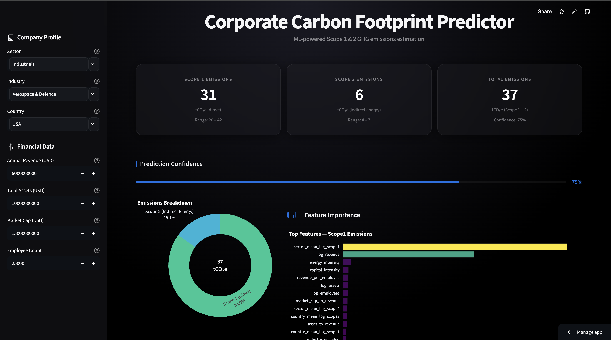
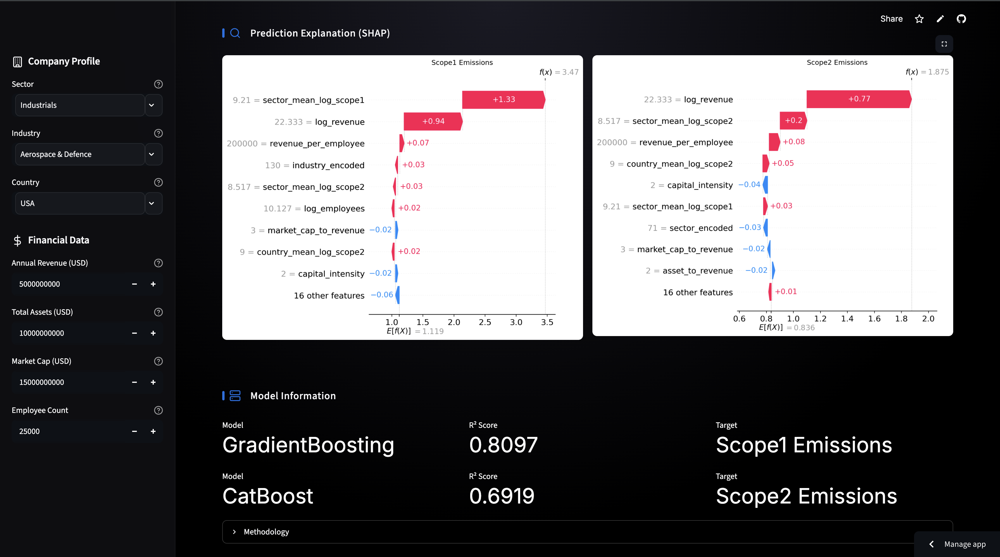

<p align="center">
  <h1 align="center">🌍 Corporate Carbon Footprint Predictor</h1>
  <p align="center">
    <strong>ML-powered Scope 1 & Scope 2 GHG emissions estimation from public financial data</strong>
  </p>
  <p align="center">
    
    
    
    
    
  </p>
</p>

---

## Overview



A production-quality machine learning system that predicts a company's **Scope 1** (direct) and **Scope 2** (indirect energy) greenhouse gas emissions using publicly available financial and operational data.



Built to the quality standards expected from ESG analytics providers such as **MSCI, Sustainalytics, Clarity AI, Bloomberg**, and **Morningstar**.

### Key Features

| Feature | Description |
|---|---|
| 🔄 **Multi-source data ingestion** | CDP Open Data, Yahoo Finance, World Bank API with CSV fallbacks |
| 🧹 **Robust preprocessing** | Company name normalisation, sector validation, outlier detection, imputation |
| 📊 **Interactive EDA** | 9+ Plotly charts: distributions, correlations, sector comparisons |
| 🤖 **6-model comparison** | Linear Regression → Random Forest → Gradient Boosting → XGBoost → CatBoost → LightGBM |
| 🎯 **Sector-aware validation** | GroupKFold CV preventing data leakage from group aggregation features |
| 🔍 **Full SHAP explainability** | Beeswarm, waterfall, force, dependence, and bar plots |
| 🚀 **Streamlit dashboard** | Dark-themed production UI with real-time predictions |
| 📝 **Comprehensive docs** | Model card, methodology, architecture diagrams |

---

## Architecture

```
┌─────────────────────────────────────────────────────────────────┐
│                      DATA SOURCES                              │
│  ┌──────────┐   ┌──────────────┐   ┌───────────────┐          │
│  │ CDP Open │   │Yahoo Finance │   │  World Bank   │          │
│  │   Data   │   │   (yfinance) │   │   (wbgapi)    │          │
│  └────┬─────┘   └──────┬───────┘   └───────┬───────┘          │
│       │                │                    │                  │
│       └────────────┬───┘────────────────────┘                  │
│                    ▼                                           │
│            ┌───────────────┐                                   │
│            │  ingestion.py │  ← CSV fallback + synthetic data  │
│            └───────┬───────┘                                   │
│                    ▼                                           │
│         ┌──────────────────┐                                   │
│         │ preprocessing.py │  ← clean, impute, normalise       │
│         └────────┬─────────┘                                   │
│                  ▼                                             │
│     ┌────────────────────────┐                                 │
│     │ feature_engineering.py │  ← ratios, logs, encodings      │
│     └────────────┬───────────┘                                 │
│                  ▼                                             │
│          ┌─────────────┐                                       │
│          │  train.py    │  ← 6 models, RandomizedSearchCV      │
│          └──────┬──────┘                                       │
│                 ▼                                              │
│     ┌───────────────────┐    ┌──────────────────┐              │
│     │   evaluate.py     │───▶│  shap_analysis.py│              │
│     └───────────────────┘    └──────────────────┘              │
│                 │                     │                        │
│                 ▼                     ▼                        │
│       ┌──────────────────────────────────────┐                 │
│       │     Streamlit Dashboard (app/)       │                 │
│       │  predict.py ← best model only        │                 │
│       └──────────────────────────────────────┘                 │
└─────────────────────────────────────────────────────────────────┘
```

---

## Quick Start

### 1. Clone & Install

```bash
git clone https://github.com/yourusername/CorporateCarbonPredictor.git
cd CorporateCarbonPredictor

python -m venv .venv
source .venv/bin/activate   # Windows: .venv\Scripts\activate

pip install -r requirements.txt
pip install -e .
```

### 2. Generate Data & Train

```bash
# Generate synthetic training data (500 companies)
python -m src.synthetic_data

# Run ingestion pipeline
python -m src.ingestion --synthetic

# Clean and preprocess
python -m src.preprocessing

# Engineer features
python -m src.feature_engineering

# Train all 6 models (with hyperparameter tuning)
python -m src.train

# Evaluate best model
python -m src.evaluate

# Generate SHAP explanations
python -m src.shap_analysis
```

### 3. Launch Dashboard

```bash
streamlit run app/streamlit_app.py
```

### Quick Smoke Test

```bash
python -m src.train --smoke-test
```

---

## Project Structure

```
CorporateCarbonPredictor/
│
├── config.py                    # Central configuration
├── requirements.txt             # Dependencies
├── setup.py                     # Package setup
│
├── data/
│   ├── raw/                     # Raw ingested data
│   ├── processed/               # Cleaned & engineered features
│   └── external/                # World Bank / macro data
│
├── src/
│   ├── ingestion.py             # Multi-source data collection
│   ├── synthetic_data.py        # Realistic data generator
│   ├── preprocessing.py         # Cleaning & normalisation
│   ├── feature_engineering.py   # Feature creation & encoding
│   ├── train.py                 # 6-model training pipeline
│   ├── evaluate.py              # Metrics & diagnostic plots
│   ├── shap_analysis.py         # SHAP explainability
│   ├── predict.py               # Production prediction API
│   └── utils.py                 # Shared utilities
│
├── models/                      # Saved model binaries
├── app/
│   └── streamlit_app.py         # Prediction dashboard
│
├── notebooks/
│   ├── 01_EDA.ipynb
│   ├── 02_FeatureEngineering.ipynb
│   ├── 03_ModelTraining.ipynb
│   └── 04_SHAP_Analysis.ipynb
│
├── reports/
│   ├── figures/                 # EDA & evaluation charts
│   └── shap/                    # SHAP plots
│
└── docs/
    ├── INSTALLATION.md
    ├── METHODOLOGY.md
    ├── MODEL_CARD.md
    ├── ARCHITECTURE.md
    └── FUTURE_IMPROVEMENTS.md
```

---

## Models

| Model | Type | Tuning |
|---|---|---|
| Linear Regression | Baseline | None |
| Random Forest | Ensemble (bagging) | RandomizedSearchCV |
| Gradient Boosting | Ensemble (boosting) | RandomizedSearchCV |
| XGBoost | Gradient boosting | RandomizedSearchCV |
| CatBoost | Gradient boosting | RandomizedSearchCV |
| LightGBM | Gradient boosting | RandomizedSearchCV |

All models are evaluated with:
- **R²** (coefficient of determination)
- **RMSE** (root mean squared error)
- **MAE** (mean absolute error)
- **MAPE** (mean absolute percentage error)
- **5-fold sector-aware cross-validation** (GroupKFold)

---

## Features Engineered

| Feature | Description |
|---|---|
| `log_revenue` | Log-transformed annual revenue |
| `log_assets` | Log-transformed total assets |
| `log_employees` | Log-transformed employee count |
| `log_market_cap` | Log-transformed market capitalisation |
| `asset_per_employee` | Capital per worker |
| `revenue_per_employee` | Labour productivity |
| `asset_to_revenue` | Asset intensity |
| `employee_density` | Workers per unit capital |
| `market_cap_to_revenue` | Valuation multiple |
| `capital_intensity` | Assets / Revenue |
| `gdp_per_capita` | Country economic development |
| `energy_intensity` | Country energy consumption profile |
| `sector_encoded` | Ordinal sector encoding |
| `sector_mean_log_*` | Sector-level emission aggregation (leakage-safe) |

---

## Explainability

SHAP (SHapley Additive exPlanations) is used to provide:

- **Global interpretation**: Which features matter most across all predictions
- **Local interpretation**: Why a specific company received its prediction
- **Dependence analysis**: How individual features influence emissions

---

## License

MIT License — see [LICENSE](LICENSE) for details.

---

## Citation

If you use this work in research, please cite:

```bibtex
@software{carbon_predictor,
  title={Corporate Carbon Footprint Predictor},
  author={Harihara},
  year={2026},
  url={https://github.com/yourusername/CorporateCarbonPredictor}
}
```
