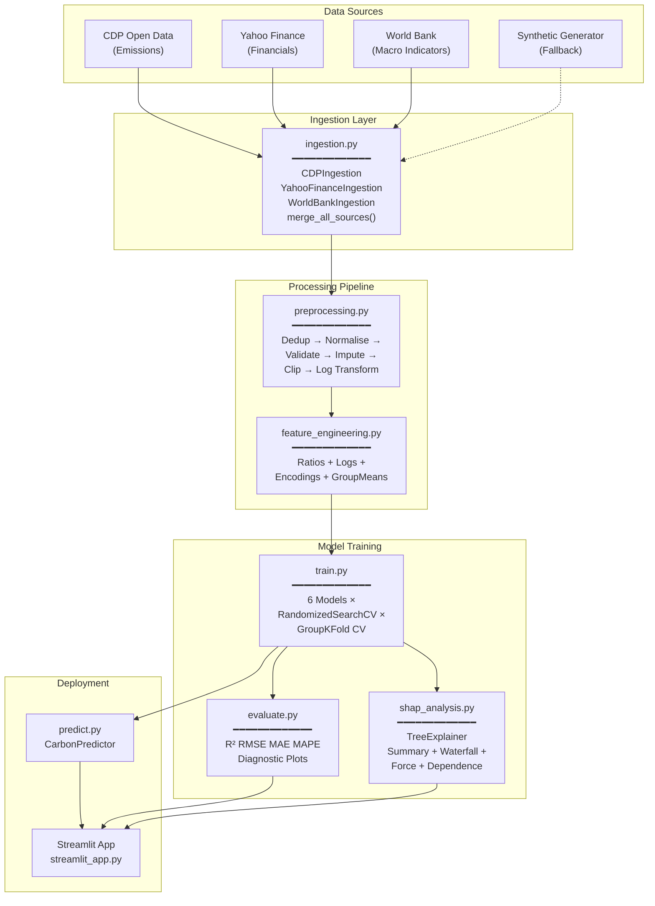
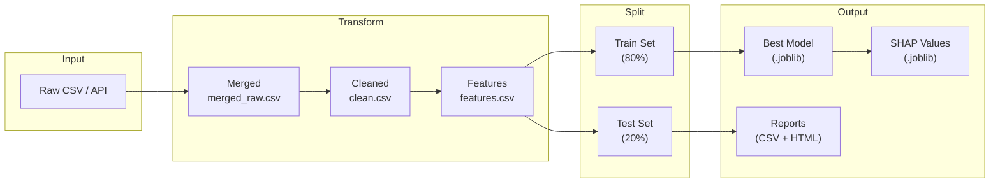

# Architecture

## System Architecture

## Data Flow Diagram

## Module Dependencies

```mermaid
graph LR
    CFG["config.py"] --> UTL["utils.py"]
    CFG --> ING["ingestion.py"]
    CFG --> SYN["synthetic_data.py"]
    CFG --> PRE["preprocessing.py"]
    CFG --> FE["feature_engineering.py"]
    CFG --> TR["train.py"]
    CFG --> EV["evaluate.py"]
    CFG --> SH["shap_analysis.py"]
    CFG --> PR["predict.py"]
    CFG --> ST["streamlit_app.py"]

    UTL --> ING
    UTL --> PRE
    UTL --> FE
    UTL --> EV

    SYN --> ING
    EV --> TR
    FE --> TR
    PR --> ST
    SYN --> PR
    SYN --> ST

    style CFG fill:#1a1a2e
    style ST fill:#16213e
```

## Key Design Decisions

### 1. Leakage-Safe Group Aggregation
Group-level features (`sector_mean_log_scope1`, etc.) are implemented as a sklearn `TransformerMixin` that fits only on training data within each CV fold.

### 2. Dual-Mode Ingestion
Every data source has a primary (API) and fallback (CSV) path, plus a final fallback to synthetic data. This ensures the pipeline is always runnable.

### 3. Log-Space Modelling
Models predict `log1p(emissions)` rather than raw emissions. This:
- Handles the heavy right-skew in emissions data
- Naturally produces positive predictions after `expm1`
- Stabilises gradient-based optimization

### 4. Best-Model-Only Deployment
All 6 models are trained and compared, but only the best (by R²) is loaded by the Streamlit app. This keeps the deployment footprint minimal.
